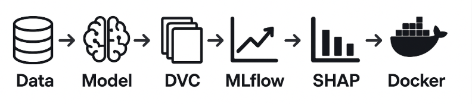

# NVIDIA-Stock-Trend-Classifier-MLOps

**End-to-End ML Project with MLOps and Dockerization**

This project predicts whether a stock’s closing price will go **up** or **down** the next day based on historical data.  

## Project Overview
This project demonstrates a complete MLOps workflow:
- 📊 Building a baseline RandomForestClassifier for stock movement prediction
- 📂 Dataset & model versioning with **DVC**.
- 📈 Experiment tracking using **MLflow**.
- 🔎 Model explainability with **SHAP**.
- ⚡ Deployment with **FastAPI** and **Docker**.




## 📂Project Structure

├── data/
│   └── Nvidia_stock_processed.csv
│   └── Nvidia_stock.csv
├── dvcstore
├── mlruns
├── models/
│   └── model.pkl
├── reports/
│   └── shap_summary.png 
├── src/
│   ├── app.py          # FastAPI app for inference
│   ├── data_prep.py    # Data preprocessing script
│   ├── train.py        # Model training script
│   └── explain.py      # SHAP explainability script
├── Dockerfile
├── dvc.yaml
├── README.md
└── requirements.txt


## ⚙️Setup Instructions

### 1. Clone the repository
```bash
git clone <repo_url>
cd <repo_folder>
```

### 2. Create a virtual environment
```bash
python3 -m venv .venv
source .venv/bin/activate
pip install -r requirements.txt
```

### 3. Initialize DVC (Local storage)
```bash
dvc init
dvc remote add -d localremote ./dvcstore
dvc add data/Nvidia_stock.csv
dvc add models/model.pkl
git add data/Nvidia_stock.csv.dvc models/model.pkl.dvc .gitignore
git commit -m "Track data and model with DVC"
```

### 4. Run pipeline
```bash
dvc repro
```

### 5. Start MLflow Tracking UI
```bash
mlflow ui
```
- ➡️ Open http://127.0.0.1:5000
 to monitor experiments


### 6. Docker Deployment
```bash
docker build -t nvidia-stock-api .
docker run -p 8000:8000 nvidia-stock-api
```
- API endpoint: **POST** http://localhost:8000/predict with JSON payload.

- Swagger docs: http://localhost:8000/docs

##⭐ Key Features

- ✅ Baseline RandomForestClassifier

- ✅ DVC for dataset & model versioning

- ✅ MLflow for experiment tracking

- ✅ SHAP visualizations for explainability

- ✅ Dockerized FastAPI API for deployment

## 🔮Future Scope

- 🎯 Hyperparameter tuning & advanced model optimization

- 🔄 CI/CD integration for automated deployment

- ⏱️ Real-time stock trend prediction with streaming data